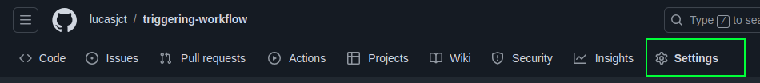
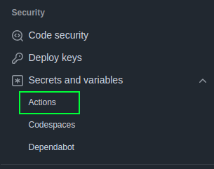
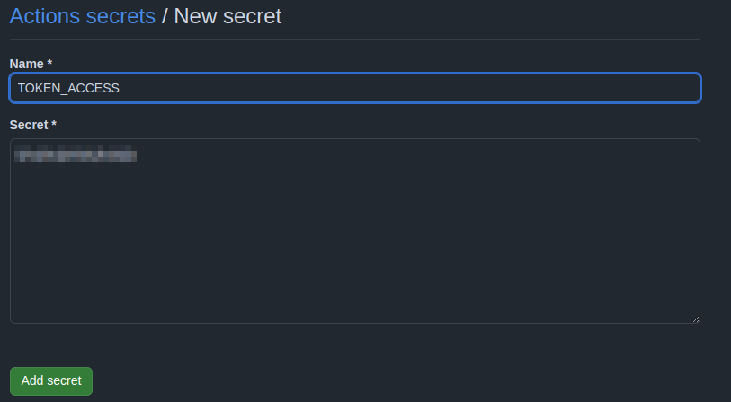

# triggering-workflow

Triggering workflow from another repository   

## Topics covered

1.  Create token with permissions to access repository and workflow.  

2. Save the token as a Secrets.

3. Create the workflow that will call the external workflow from another repository among the steps.  

4. Apply the correct workflow type to external repository called.   

5. Run action.  

### 1 Creating token: 

As we use the GitHub API, we need some token with necessary permissions to send events. For to do this, access __"Settings"__, on the top right side.   

    

After that, go to the left side and access respectively: __"Developer settings"__ > __"Personal access tokens"__  > __"Tokens (classic)"__  

Developer settings    

   

Tokens (classic)  

    

Select __"Generate new token (classic)"__ 

     

Select the permissions to access repository and workflow:  

  

Finally, click on "Generate Token"  and the token will be created. Copy this token, because we will use it on the next step:     

### 2 Save the token as a Secrets.  

The token saved, now we should attribute the token value to one secret.  
Go to the repository __Settings__.   

  

Select __Secrets and Variables__ and click on __Actions__:  

   

Now, click on button __"New reposistory secret"__.  And paste the token value, and give a name to this variable. Finally, click on __"Add secret"__ .  

  

All done! Now, we can use this value into bearer token and send requests.   

### 3. Create the workflow that will call the external workflow from another repository
